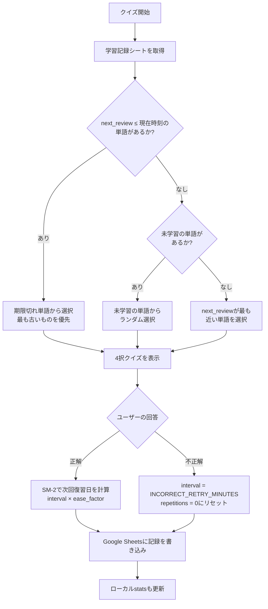

# VocabLib: 正誤記録 & 忘却曲線ベースの出題機能

Google Spreadsheetに単語ごとの正誤履歴を記録し、エビングハウスの忘却曲線に基づいて復習が必要な単語を優先的に出題する機能を追加する。

## User Review Required

> [!CAUTION]
> **「シート1」の A列（英単語）・B列（日本語訳）は一切変更しません。** 引き続きユーザーが手動で単語と意味を入力する運用はそのままです。

> [!IMPORTANT]
> **Google Sheets APIスコープの変更**: 現在 `spreadsheets.readonly` スコープのみ使用していますが、正誤記録の書き込みのために `spreadsheets` (読み書き) スコープに変更します。既存の `token.json` を削除して再認証が必要になります。

> [!IMPORTANT]
> **スプレッドシートに新しいシートを追加**: 同じスプレッドシート内に正誤記録用の **「学習記録」シート** を自動作成します。「シート1」のデータには影響しません。

---

## 2シート構成

```
同一スプレッドシート
┌──────────────────────────────────────────┐
│  「シート1」（既存・変更なし）              │
│  ユーザーが手動で管理する単語帳             │
│  ┌──────────┬──────────────┐              │
│  │ A列(単語) │ B列(日本語訳) │              │
│  │ apple     │ りんご        │              │
│  │ study     │ 勉強する      │              │
│  └──────────┴──────────────┘              │
│                                           │
│  「学習記録」（新規・アプリが自動管理）       │
│  正誤データをアプリが自動で読み書き          │
│  ┌──────┬────────┬─────────┬─────┬...┐  │
│  │ word │meaning │next_rev │ EF  │   │  │
│  │ apple│りんご   │2026-3-24│ 2.5 │   │  │
│  └──────┴────────┴─────────┴─────┴...┘  │
└──────────────────────────────────────────┘
```

---

## 現状の課題

| 項目 | 現状 | 改善後 |
|------|------|--------|
| 出題方式 | 完全ランダム | 忘却曲線に基づく優先出題 |
| 正誤記録 | ローカル `stats.json` に合計のみ | Google Sheetsに単語別・時刻付きで記録 |
| 復習タイミング | なし | SM-2アルゴリズムで最適な間隔を計算 |

---

## Proposed Changes

### Google Sheets「学習記録」シートの設計（新規シート・自動作成）

| A列 | B列 | C列 | D列 | E列 | F列 | G列 | H列 |
|-----|-----|-----|-----|-----|-----|-----|-----|
| word | meaning | last_reviewed | next_review | ease_factor | interval_days | repetitions | total_correct |

- **word + meaning**: **複合キー**。「シート1」のA列・B列と対応。行の挿入/削除に影響されず、多義語（同一単語・異なる意味）も区別可能
- **last_reviewed**: 最後に回答した日時（ISO 8601）
- **next_review**: 次に復習すべき日時（ISO 8601）
- **ease_factor**: SM-2の難易度係数（初期値 2.5）
- **interval_days**: 現在の復習間隔（日数）
- **repetitions**: 連続正解回数（不正解でリセット）
- **total_correct**: 累計正解数（リセットされない）

> [!NOTE]
> `word + meaning` を複合キーとすることで、「シート1」で行の挿入・削除・並び替えを行っても学習記録がズレません。同一英単語でも意味が異なれば別エントリとして追跡されます。

---

### Spaced Repetition (忘却曲線ロジック)

#### [NEW] [spaced_repetition.py](file:///Users/yujikatagi/C_personal/VocabLib/src/spaced_repetition.py)

SM-2アルゴリズムの実装:

```python
from .config import INCORRECT_RETRY_MINUTES

def calculate_next_review(quality, repetitions, ease_factor, interval):
    """
    quality: 回答品質 (0-5)
      - 正解 → 4
      - 不正解 → 1
    """
    if quality >= 3:  # 正解
        if repetitions == 0: interval = 1        # 初回: 1日後
        elif repetitions == 1: interval = 6      # 2回目: 6日後
        else: interval = interval * ease_factor  # 以降: 前回間隔 × EF
        repetitions += 1
    else:  # 不正解
        repetitions = 0
        interval = INCORRECT_RETRY_MINUTES / (60 * 24)  # .env設定値を日数に変換
    
    # EF更新: EF' = EF + (0.1 - (5-q) * (0.08 + (5-q) * 0.02))
    ease_factor = max(1.3, ease_factor + 0.1 - (5 - quality) * (0.08 + (5 - quality) * 0.02))
    
    next_review = now + timedelta(days=interval)
    return next_review, ease_factor, interval, repetitions
```

`select_word(records, words)` の出題優先順位（上から順に適用）:

| 優先度 | 条件 | 挙動 |
|--------|------|------|
| 1 | `next_review ≤ 現在時刻` の単語がある | 期限超過が最も古いものを選択 |
| 2 | 未学習の単語がある（学習記録に未登録） | 未学習からランダム選択 |
| 3 | 全単語が学習済みで期限前 | `next_review` が最も近い単語を選択 |

---

### Sheets Client の拡張

#### [MODIFY] [sheets_client.py](file:///Users/yujikatagi/C_personal/VocabLib/src/sheets_client.py)

**変更内容:**

1. **スコープ変更**: `spreadsheets.readonly` → `spreadsheets`
2. **新メソッド追加**:
   - `fetch_learning_records()`: 「学習記録」シートから全単語の学習データを取得
   - `record_answer(word, meaning, is_correct)`: 正誤結果をスプレッドシートに書き込み（`word + meaning` で一意に特定）
   - `ensure_learning_sheet_exists()`: 「学習記録」シートが存在しない場合にヘッダー行付きで自動作成
3. **`get_random_word()` → `get_next_word()`**: 忘却曲線ロジックを使って次の出題単語を決定。戻り値は `(word, meaning)`（変更なし）

```diff
-SCOPES = ['https://www.googleapis.com/auth/spreadsheets.readonly']
+SCOPES = ['https://www.googleapis.com/auth/spreadsheets']
```

---

### Config の拡張

#### [MODIFY] [config.py](file:///Users/yujikatagi/C_personal/VocabLib/src/config.py)

```diff
+# 学習記録シート設定
+LEARNING_SHEET_NAME = os.getenv("LEARNING_SHEET_NAME", "学習記録")
+
+# 忘却曲線設定
+INITIAL_EASE_FACTOR = float(os.getenv("INITIAL_EASE_FACTOR", "2.5"))
+INCORRECT_RETRY_MINUTES = int(os.getenv("INCORRECT_RETRY_MINUTES", "5"))
```

---

### App の変更

#### [MODIFY] [app.py](file:///Users/yujikatagi/C_personal/VocabLib/src/app.py)

**変更内容:**

1. `_show_quiz()`: `get_random_word()` → `get_next_word()` に変更
2. `current_quiz` に `correct_word` と `correct_meaning` を明示的に保持（`quiz['question']` に依存しない）
3. `_check_answer()`: 正誤結果を `sheets_client.record_answer()` で記録

```diff
 def _show_quiz(self, _=None):
-    word_data = self.sheets_client.get_random_word()
+    word_data = self.sheets_client.get_next_word()
     ...
     correct_word, correct_meaning = word_data
     ...
     quiz = self.ollama_client.generate_quiz(correct_word, correct_meaning, other_words)
+    # correct_word / correct_meaning を quiz に明示保持（question 文面に依存しない）
+    quiz['correct_word'] = correct_word
+    quiz['correct_meaning'] = correct_meaning
```

```diff
 def _check_answer(self, user_choice, correct_index, quiz):
     ...
+    # Google Sheetsに正誤記録を書き込み（quiz['question'] ではなく correct_word を使用）
+    is_correct = (user_choice == correct_index)
+    self.sheets_client.record_answer(quiz['correct_word'], quiz['correct_meaning'], is_correct)
```

---

### その他

#### [MODIFY] [.env.example](file:///Users/yujikatagi/C_personal/VocabLib/.env.example)

新しい環境変数を追加。

#### [MODIFY] [README.md](file:///Users/yujikatagi/C_personal/VocabLib/README.md)

忘却曲線機能の説明、「学習記録」シートの自動作成についてドキュメント追記。

---

## データフロー図



---

## Verification Plan

### ユニットテスト: SM-2ロジック (`tests/test_spaced_repetition.py`)

```bash
uv run python -m pytest tests/test_spaced_repetition.py -v
```

テストケース:
- 初回正解 → `interval = 1日`, `repetitions = 1`
- 2回目正解 → `interval = 6日`, `repetitions = 2`
- 3回目正解 → `interval = 6 * 2.5 = 15日`
- 不正解 → `interval = INCORRECT_RETRY_MINUTES / 1440 日`, `repetitions = 0`
- `ease_factor` が1.3未満にならないこと
- `select_word()` が優先順位テーブル通りに動作すること（期限切れ > 未学習 > 期限前最短）

### ユニットテスト: Sheets API モック (`tests/test_sheets_learning.py`)

```bash
uv run python -m pytest tests/test_sheets_learning.py -v
```

テストケース（`unittest.mock.patch` でGoogle Sheets APIをモック）:
- `ensure_learning_sheet_exists()`: シートが存在しない場合に `batchUpdate` で自動作成されること
- `record_answer()`: `word + meaning` で既存行を特定し正しく更新すること
- `record_answer()`: 学習記録に未登録の単語は新規行が追加されること
- `fetch_learning_records()`: スプレッドシートの値が正しくパースされること

### 手動テスト

1. `token.json` を削除して再認証を実行
2. アプリを起動し、クイズに正解/不正解で回答
3. Google Spreadsheetの「学習記録」シートにレコードが `word + meaning` 付きで作成・更新されることを確認
4. 不正解の単語が `INCORRECT_RETRY_MINUTES` 後に再出題されることを確認
5. 同一英単語で異なる意味が「シート1」にある場合、別々に追跡されることを確認

> [!NOTE]
> 既存のテストファイル (`test_rumps_timer.py`, `test_timer.py`) は rumps タイマーの動作テスト用で、今回の変更とは無関係です。
